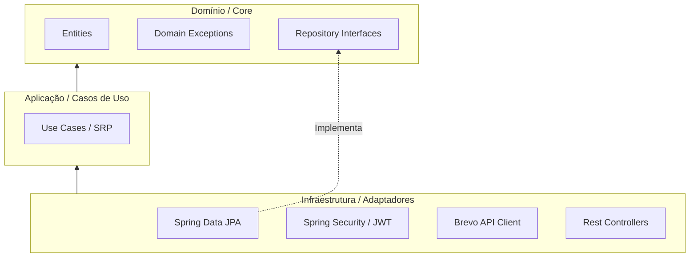
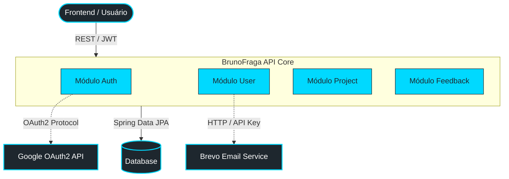
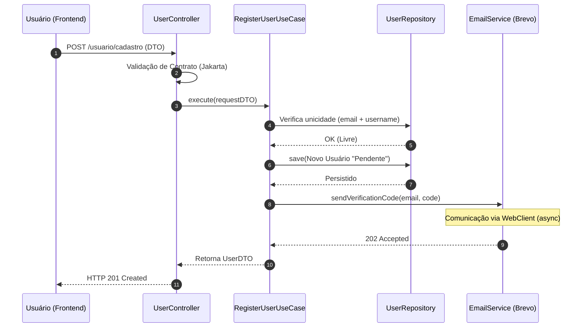
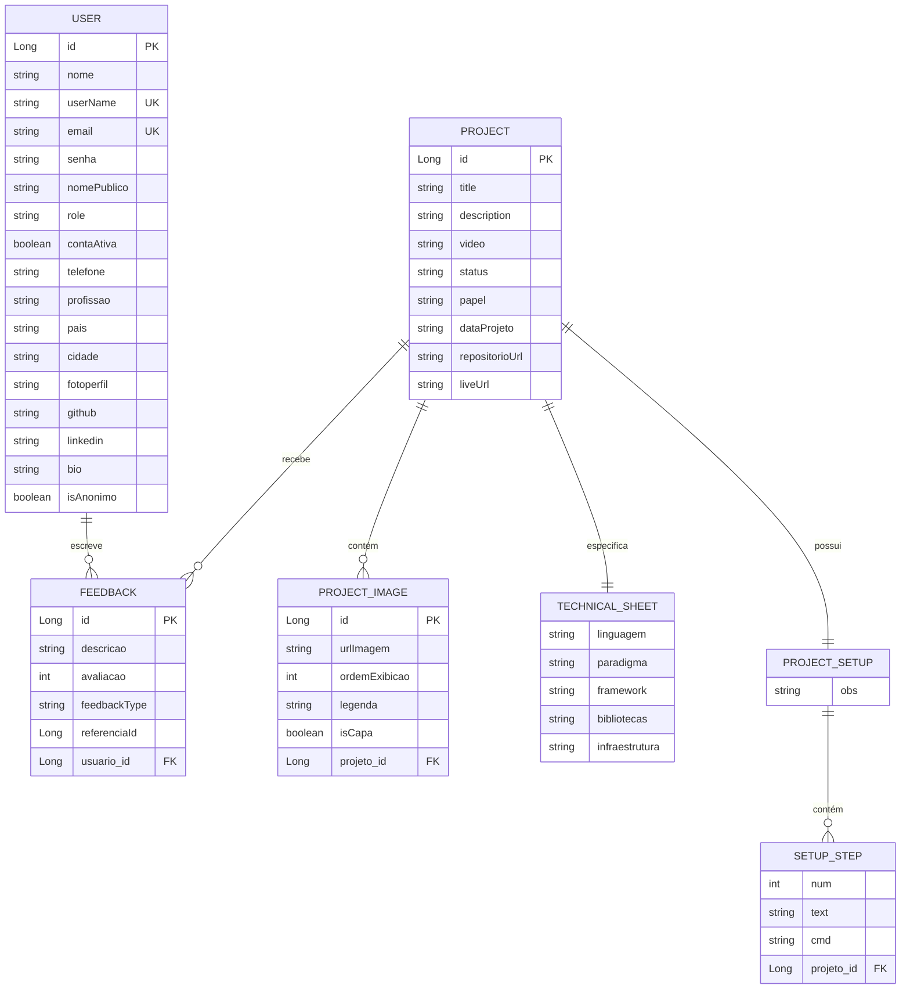

<div align="center">

#  BrunoFragaDev — Portfolio API

**API RESTful de produção para autenticação, gerenciamento de portfólio e coleta de feedbacks.**

[](https://openjdk.org/projects/jdk/21/)
[](https://spring.io/projects/spring-boot)
[](https://spring.io/projects/spring-security)
[](https://swagger.io/)
[](LICENSE)

🔗 **[brunofragadev.com](https://www.brunofragadev.com)**

</div>

---

## 📋 Sobre o Projeto

Backend da plataforma **[brunofragadev.com](https://www.brunofragadev.com)** — um sistema de portfólio pessoal com autenticação completa, gerenciamento de projetos e coleta de feedbacks de usuários reais.

Este projeto foi desenvolvido simulando um **ambiente de produção real**, com foco em:

- 🏗️ **Arquitetura limpa** (Clean Architecture + DDD)
- 🔒 **Segurança robusta** (JWT + Google OAuth2)
- 📬 **Comunicação assíncrona** (e-mails transacionais via Brevo API)
- ⚡ **Escalabilidade** (design stateless, baixo acoplamento)
- 🧪 **Testabilidade** (Use Cases com responsabilidade única)

---

## 🧱 Arquitetura

O projeto segue os princípios de **Clean Architecture** combinados com **Domain-Driven Design (DDD)**, organizado em quatro camadas bem definidas:

| Camada | Responsabilidade |
|---|---|
| **Domain** | Núcleo do sistema. Contém as entidades ricas de negócio (`User`, `Project`, `Feedback`) e exceções de domínio. Isolada — sem dependências de frameworks externos. |
| **Application** | Orquestra as regras de negócio através de **Use Cases com responsabilidade única** (ex: `RegisterUserUseCase`, `ActivateAccountUseCase`). Evita "God Classes". |
| **Infrastructure** | Comunicação com o mundo externo: repositórios (Spring Data JPA), segurança (Spring Security/JWT), e-mail (Brevo via WebClient) e tratamento global de exceções. |
| **API / Controllers** | Porta de entrada da aplicação. Recebe requisições HTTP, valida contratos de entrada via DTOs e delega à camada de Application. |

### Mapa de Camadas



### 🤔 Decisões de Arquitetura

<details>
<summary><strong>Por que Clean Architecture?</strong></summary>

Para evitar acoplamento com frameworks como Spring, garantindo:
- Facilidade de testes unitários sem dependências externas
- Independência de infraestrutura — o domínio não sabe que o Spring existe
- Evolução do sistema sem impacto no núcleo de negócio

</details>

<details>
<summary><strong>Por que Use Cases ao invés de Services genéricos?</strong></summary>

"God Classes" de serviço concentram responsabilidades demais, dificultando manutenção e testes. Cada Use Case resolve **um único problema**:

- `RegisterUserUseCase` — apenas cadastra um novo usuário
- `ActivateAccountUseCase` — apenas ativa uma conta pendente
- `ProcessGoogleLoginUseCase` — apenas processa o login social

Resultado: maior **legibilidade**, **testabilidade** e **manutenibilidade**.

</details>

<details>
<summary><strong>Por que JWT ao invés de sessões?</strong></summary>

- **Stateless**: o servidor não precisa armazenar estado de sessão
- **Escalabilidade horizontal**: qualquer instância da API consegue validar o token
- **Integração facilitada** com o frontend desacoplado (Next.js/React)

</details>

---

## 🗺️ Visão Geral do Sistema



---

## ⚙️ Funcionalidades

### 🔐 Autenticação & Segurança

- Autenticação via credenciais (usuário/senha) com geração de **token JWT**
- Login social via **Google OAuth2**
- **Controle de acesso baseado em permissões (RBAC)** com 4 níveis de role: `USER`, `ADMIN1`, `ADMIN2`, `ADMIN3`
- Verificação de disponibilidade de nome de usuário e e-mail

### 👤 Gerenciamento de Usuários

- Cadastro com status **pendente** e ativação de conta via **código de verificação de 6 dígitos** enviado por e-mail
- Recuperação e alteração de senha com código de segurança
- Edição de perfil: nome público, profissão, telefone, país, cidade, links do GitHub/LinkedIn e biografia
- Upload e gestão de foto de perfil via URL
- **Modo anônimo**: controle de visibilidade do perfil
- Consulta das informações do usuário autenticado
- Listagem e gestão de usuários (painel administrativo)

### 📁 Gerenciamento de Projetos (Portfólio)

- CRUD completo de projetos com título, descrição e metadados
- Galeria de imagens por projeto com URL, ordem de exibição, legenda e definição de capa
- **Ficha técnica**: linguagem, paradigma, framework, bibliotecas e infraestrutura
- **Guia de setup**: passos sequenciais com comandos de terminal
- Listagem pública e consulta detalhada por ID

### 📁 Gerenciamento de Artigos

- CRUD completo de artigos com título, subtilo, tags, body extenso para escrita do artigo
- Galeria de imagens por projeto com URL, ordem de exibição, legenda e definição de capa
- Foto de capa
- Renderização automatica dos ultimos 5 artigos publicadas
- Renderização em pagina exclusiva automatica após a publicação na farramenta de escrita

### 💬 Sistema de Feedbacks

- Submissão de feedbacks com comentário e nota de 1 a 5
- Classificação: **Geral** (plataforma) ou **vinculado a Projeto/Artigo** específico
- Envio de feedbacks anônimos
- Listagem e visualização de feedbacks
- Moderação: edição e exclusão (administrativo)
- Exclusão em massa de feedbacks vinculados a um projeto

### 📧 Notificações por E-mail

- E-mail de boas-vindas ao cadastrar
- Código de verificação para ativação de conta
- E-mail de recuperação de senha
- **Notificação automática para o administrador** a cada novo feedback recebido

### 🛠️ Infraestrutura & Qualidade

- Tratamento centralizado de erros e exceções (`@ControllerAdvice`)
- Padronização de respostas da API (sucesso e erro)
- Auditoria automática de datas de criação e modificação dos registros
- Documentação técnica interativa via **Swagger UI / OpenAPI**

---

## 🔄 Fluxo: Cadastro e Ativação de Conta



---

## 🗄️ Modelo de Dados

### Diagrama de Entidades (ERD)



### Hierarquia de Papéis (RBAC)

```
ADMIN3  →  ROLE_ADMIN3 + ROLE_ADMIN2 + ROLE_ADMIN1 + ROLE_USER
ADMIN2  →  ROLE_ADMIN2 + ROLE_ADMIN1 + ROLE_USER
ADMIN1  →  ROLE_ADMIN1 + ROLE_USER
USER    →  ROLE_USER
```

---

## 🛠️ Tecnologias

| Categoria | Tecnologia |
|---|---|
| **Linguagem** | Java 21 |
| **Framework** | Spring Boot 3.4.2 |
| **Segurança** | Spring Security + JWT |
| **Login Social** | Google OAuth2 |
| **Persistência** | Spring Data JPA / Hibernate |
| **Banco de Dados** | H2 (desenvolvimento) / MySQL (produção) |
| **E-mail** | Brevo API via WebClient |
| **Documentação** | Swagger UI / OpenAPI |
| **Build** | Maven |
| **Validação** | Jakarta Bean Validation |

---

## 📁 Estrutura de Diretórios

```text
src/main/java/com/brunofragadev/
├── module/
│   ├── auth/
│   │   ├── api/               # Controllers de autenticação
│   │   └── application/       # Use Cases: Login, Google OAuth2, JWT
│   ├── feedback/
│   │   ├── api/               # Controllers e DTOs de feedback
│   │   ├── application/       # Use Cases: Criar, Listar, Moderar
│   │   └── domain/            # Entidade Feedback, FeedbackType
│   ├── project/
│   │   ├── api/               # Controllers e DTOs de projeto
│   │   ├── application/       # Use Cases: CRUD, Galeria, Setup
│   │   └── domain/            # Project, ProjectImage, TechnicalSheet, SetupStep
│   └── user/
│       ├── api/               # Controllers e DTOs (Request/Response)
│       ├── application/       # Use Cases: Register, Activate, UpdateProfile...
│       ├── domain/            # Entidade User, Role, Exceções de domínio
│       └── infrastructure/    # Mappers e Repositories
├── infrastructure/
│   ├── config/                # Configurações globais (Security, Audit, JWT)
│   ├── email/                 # Integração com a API do Brevo
│   └── handler/               # Global Exception Handler
└── shared/                    # Utilitários, Auditable, VerificationCode
```

---

## 🚀 Como Executar Localmente

### Pré-requisitos

- Java 21+
- Maven 3.9+
- Conta na [Brevo](https://www.brevo.com/) para envio de e-mails (opcional em dev)
- Credenciais do Google OAuth2 (opcional em dev)

### 1. Clone o repositório

```bash
git clone https://github.com/brunofragadev/brunofragadev-api](https://github.com/brunofdev/brunofragadev-api.git
cd portfolio-api
```

### 2. Configure as variáveis de ambiente

Crie um arquivo `.env` ou configure as variáveis no `application.properties`:

```properties
# JWT
jwt.secret=sua_chave_secreta_aqui
jwt.expiration=86400000

# Brevo (E-mail)
brevo.api.key=sua_api_key_brevo

# Google OAuth2
spring.security.oauth2.client.registration.google.client-id=seu_client_id
spring.security.oauth2.client.registration.google.client-secret=seu_client_secret
```

### 3. Execute a aplicação

```bash
mvn spring-boot:run
```

A API estará disponível em: `http://localhost:8080`

### 4. Acesse a documentação interativa

```
http://localhost:8080/swagger-ui.html
```

---

## 📖 Documentação da API

A documentação completa dos endpoints está disponível via **Swagger UI** após iniciar a aplicação, ou pode ser consultada no formato OpenAPI em `/v3/api-docs`.

Principais grupos de endpoints:

| Módulo | Prefixo |
|---|---|
| Autenticação | `/auth` |
| Usuários | `/usuario` |
| Projetos | `/projeto` |
| Feedbacks | `/feedback` |

---

## 🤝 Contribuindo

Contribuições são bem-vindas! Siga os passos:

1. Faça um fork do projeto
2. Crie uma branch para sua feature: `git checkout -b feature/minha-feature`
3. Commit suas mudanças: `git commit -m 'feat: adiciona minha feature'`
4. Push para a branch: `git push origin feature/minha-feature`
5. Abra um Pull Request

---

## 📄 Licença

Este projeto está sob a licença MIT. Consulte o arquivo [LICENSE](LICENSE) para mais detalhes.

---

<div align="center">

Desenvolvido com ❤️ por **[Bruno Fraga](https://www.brunofragadev.com)**

[](https://linkedin.com/in/brunofragadev)
[](https://github.com/brunofragadev)
[](https://www.brunofragadev.com)

</div>
